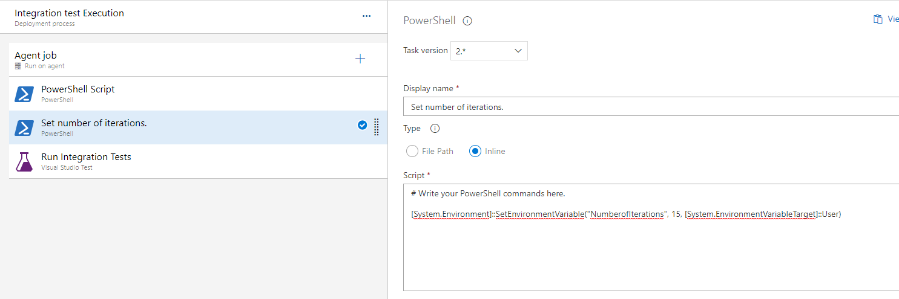
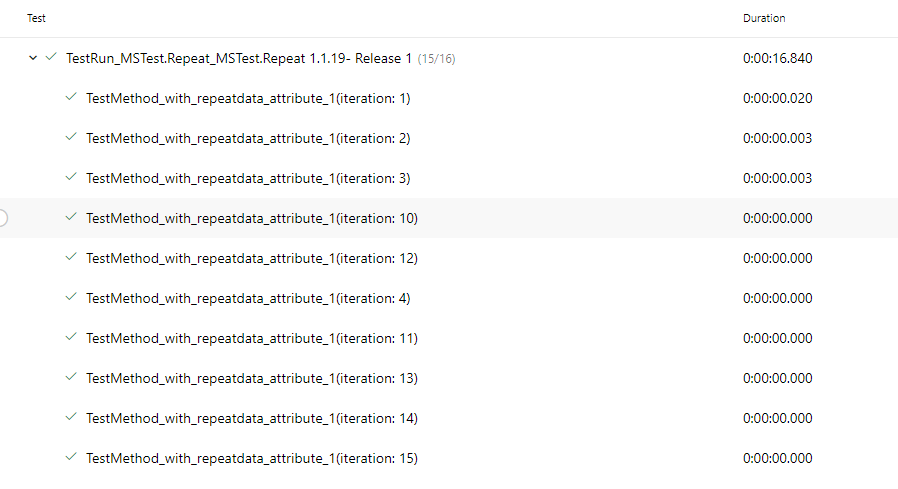

# MSTestRepeat

## Summary
If you have written an integration test using MSTest, and are looking for an easy and efficent way to run tests in a loop (stress/performance), running tests either locally or in Azure Pipelines or plan to do so soon, you can now with a small change. Enable your tests to run in a loop in Azure Pipelines or on your local machine without having to write loops in your tests! 

## Status


[View Release Pipeline for usage example](https://dev.azure.com/HermesProjects/MSTestRepeat/_release?definitionId=1&view=mine&_a=releases)


## How to
Add a reference to MSTestRepeat nuget package in your test solution. Set the Windows environment variable NumberofIterations to the number of iterations you want the test to run. If this variable is not set, the behavior even when the attributes are added will remain the same as it is today, i.e. run the test without a loop.


### Add RepeatTestMethod Attribute to use with MSTest
In your Test code file, for the test method you want to change, make the following change:

```csharp
    [TestMethod]
    public void MyTestMethod()
    {
        .... // Your test code.
    }
```
to

```csharp
    [RepeatTestMethod]
    public void MyTestMethod()
    {
        ... // Your test code.
    }
```

## My code is ready, what's next.
Now if you are ready to run your test in a loop follow the instructions below based on where you are executing the tests.

### Setup in Azure Release pipeline
In the stage that runs the tests with the MSTest.Repeat attribute, before the VSTest task, do the following 
1. Add a new PowerShell task
2. Set the Type of the task as Inline
3. Add the following powershell command to set the NumberofInterations variable to the desired iteration count.

```ps
    [System.Environment]::SetEnvironmentVariable("NumberofIterations", n, [System.EnvironmentVariableTarget]::User)
```
where n is an integer value representing the number of iterations you want to run tests on. 



In Azure Release Pipelines, we also have the additional option of setting a Pipeline variable and using that variable in the command here, allowing for one variable to define the number of iterations to execute tests across the Release. Users then can set the variable explicitly to kick off a manual release automation run.

### Setup on local machine.
Open a a command line window and run the following command 

```cmd
    setx NumberofIterations n
```
where n is an integer value representing the number of iterations you want to run tests on. 


## Benefits

### Accurate
Many take the approach of running a test multiple times by making a copy of an existing test and putting it in a for loop. In some cases that might be ok, but look closely at your test implementation. In my team as we are testing with Hardware, we need to run integration tests against the actual hardware. Our tests have a TestInitialize or ClassInitialize implementation and a corresponding Cleanup implementation as well, to dereference instances to certain services meant for communicating with the underlying Hardware. In this case I found, using the Attribute was a more accurate representation of how the code should function than the test would behave under a simple loop. In the simple loop implementation, the initialization and cleanup only happens once with the loop happening n times, when we want to be testing the initialization, the functionality and the cleanup all in a loop.
I ran into a couple of cases at work where teams used the simple loop approach and didn't catch any problems but switching to the attribute method, caught long standing stress problems right away.

### Integration with Azure
When tests are executed in Azure pipelines with the MSTest.Repeat attribute, all the test results are published back into Azure with the accurate iteration count. This aids in test run analysis and can further be used in creating custom reporting, example track MTTF for a test. Here's a screenshot of how the tests are recorded and reported in Azure.



### References
* [Xunit.Repeat in Nuget](https://github.com/MarcolinoPT/Xunit.Repeat). Code was borrowed from here adding the variation of reading from Enviornment variable as customization.
* [Creating custom MSTest Attributes](https://www.meziantou.net/mstest-v2-customize-test-execution.htm)
